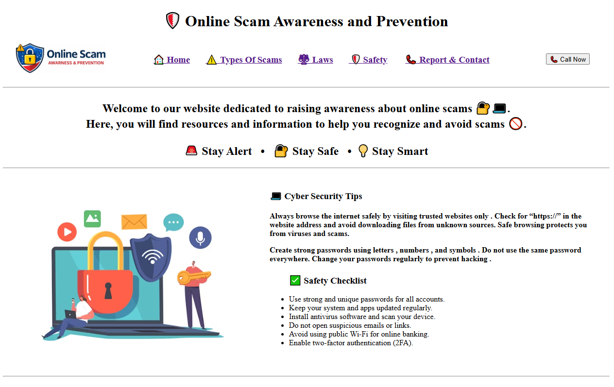

# Online Scam Awareness and Prevention

A static awareness website built using **only HTML** to educate users about common online scams and how to avoid them.

## 🔗 Live Website
https://online-scam-awareness-and-prevention.netlify.app/

## 📸 Screenshots

### 🏠 Home Page

### ⚠️ Scam Awareness Section

### 🛡️ Prevention Tips

## 📌 Features
- Information about online scams
- Prevention and safety tips
- Simple and fast-loading HTML-only website
- Deployed on Netlify

## 🛠️ Technologies Used
- HTML5
- Netlify

## 🎯 Objective
To spread cyber awareness and help users stay safe online.
